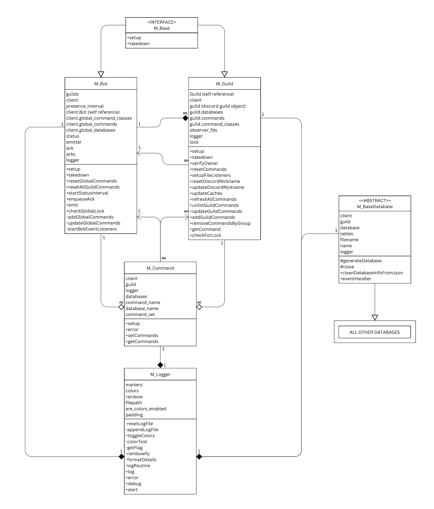
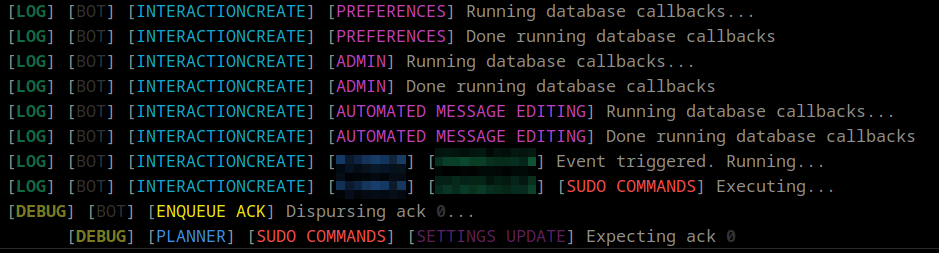

# Mauve
**Mauve** is a templatized discord bot specialized in providing as much flexibility with commands as possible via a 3-classed command hierarchy and dynamic command set refreshing.
## Command List
[ input ] means text input, ( option 1 | option 2 ) means choices separated by |, and \<list\> means sub command list. \
Commands are displayed as such:
- **command_group**: ...
	- `command <sub_command> (option 1 | option 2) [text entry] ...`
		- `Sub Command 1`: ...
		- `Sub Command 2`: ...
		- ...

**identifier:** an ID of some kind, name of some kind, or message link/ID path to an actually interpretable ID.

### Global Commands
- **dev:** Command group centered around developer commands.
	- `sudo-dev-blacklist <sub_command> [identifier]`: Lets you blacklist, whitelist, or tell the bot to leave a guild. 
		- `Blacklist`: Tells the bot to leave and never stay in the guild specified by `identifier`.
		- `Whitelist`: Removes a server from the blacklist.
		- `Leave:` Tells the bot to leave the server specified by `identifier`.
	- `sudo-dev <sub_command>`: Runs general developer-only command.
		- `Update All Guilds`: Runs an external script to update all guilds with any new JSON files in `./commands/**`.
		- `Shutdown Bot`: Shuts the bot down completely.
		- `Restart Bot`: Restarts the node process for the bot.
		- `Globally Lock Commands`: Prevents anyone from using any command except the dev.
		- `Restrict to Test Guild`: Prevents anyone in any server from using a command unless its in the `test guild` specified in `./main_config.json`.
		- `Open to All Guilds`: Allows any server to execute commands like normal.
		- `View Guilds`: Shows a JSON of all guilds the bot is in.
		- `View Blacklist`: Shows a JSON servers in the blacklist.
		- `View Main Config`: Shows `./main_config` minus the token and clientId.
- **info:** Command group focused on providing basic information about the user or bot.
	- `ping`: Responds with the latency between you sending the command and the bot receiving it.
	- `info`: Sends a JSON with basic user info like account age, ID, name, etc..
- **preferences:** Command group that allows users to change their user preferences.
	- `preferences <sub_command>`: Allows a user to toggle or view their preferences.
		- `Make Bot Responses Invisible`: Makes all bot responses invisible to everyone but the sender.
		- `Make Bot Responses Visible`: Makes all bot responses--except error messages--visible to everyone; error messages are always ephemeral/invisible to everyone but the sender.
		- `View Preferences`: Sends a JSON of the users current preferences.
### Local
- **admin:** Command group that allows users to change their user preferences.
	- `sudo-admin <sub_command> (By Role | By User) [identifier]`: Allows an admin/owner/server owner to promote or demote a user or role.
		- `Add Admin(s)`: Attempts to add the admin specified by the identifier.
		- `Remove Admin(s)`: Attempts to remove the admin specified by the identifier.
		- `Add Owners(s)`: Attempts to add the owner specified by the identifier.
		- `Remove Owners(s)`: Attempts to remove the owner specified by the identifier.
	- `sudo-command <sub_command> (Command Group 1 | ...)`: Toggles enrollment in a selective command group.
		- `Enable Command Group`: Enables the chosen command group for the server.
		- `Disable Command Group`: Disables the chosen command group for the server.
	- `sudo-fix`: Runs an external script to check every JSON file and make sure it has all necessary properties and removes all unneeded properties.
	- `sudo-lock <sub_command>`: Toggles whether users can or cannot use server commands.
		- `Lock Commands`: Locks all server commands so only admins can use them.
		- `Unlock Commands`: Unlocks all server commands so everyone can use them.
		- `Are Commands Locked`: Responds with whether commands are locked or not.
	- `sudo-nickname [nickname]`: Set's the bot's nickname to `nickname` for the server the command was sent from. Leaving the nickname blank/un-filled-out will set the bot's name back to it's original username.
	- `sudo-read (File 1 | ...)`: Let's a user view the contents in the form of a JSON for database, JSON, and log files. Files that pertain to a disabled command group will not be viewable, that is, only relevant files are viewable.
	- `sudo-reload-commands`: Sends discord an PUT API request to reload the command list for the server the command was sent from.
	- `sudo-write (JSON 1 | ...) [text]`: Let's a user remotely write to any JSON file with another JSON. Mauve will do its best to merge sent JSONs seamlessly with the already existing. NOTE: This is a *dangerous* command restricted only to server owners.
- **info:** Command group focused on providing basic information about the guild/server.
	- `where-am-i`: Responds with a JSON of information about the server like creation date, description, verification status, user join date, etc.
### Selective
- **automated_message_editing:** Command group that allows users to set certain messages to auto update with a certain file's contents every time that file is modified.
	- `sudo-auto-edit-file <sub_command> (File 1 | ...) [identifier]`: Sets whether the message marked by `identifier` should be updated with the contents of `File N` or not.
		- `Start Auto-Edit`: Starts an auto edit routine for the specified message and file.
		- `Stop Auto-Edit`: Stops an auto edit routine for the specified message regardless of the file entered.
	- `sudo-auto-edit <sub_command>`: The general moderation command for this command group.
		- `Pause Auto-Edits`: Pauses all file listeners for every message set to be auto-edited.
		- `Unpause Auto-Edits`: Unpauses all file listeners for every message set to be auto-edited.
		- `Unwatch All Messages`: Stops every message set to be auto-edited from being auto-edited, i.e., clears every message from being auto edited.
		- `See All Watched Messages`: Responds with a list of message links to every message set to be auto-edited along with the file each message is set to be updated with.
		- `Get Command Group Info`: Responds with general information about this command group like the number of messages being auto edited and the state of whether auto edits are paused or not.

  
## Command Hierarchy
### Commands
```
.
└── commands/
    ├── global/
    │   ├── command-group/
    │   │   ├── command-1.js
    │   │   ├── command-2.js
    │   │   └── ...
    │   └── ...
    ├── local/
    │   ├── command-group/
    │   │   ├── command-1.js
    │   │   ├── command-2.js
    │   │   └── ...
    │   └── ...
    └── selective/
        ├── command-group/
        │   ├── command-1.js
        │   ├── command-2.js
        │   └── ...
        └── ...
```
**Global/Local/Selective:** Command types (for the custom command type, keep reading).
- **Global Commands:** These are available everywhere including DM's. These cannot be opted out of.
- **Local Commands:** These are available in every server--not dms--and mostly consist of general purpose commands.
- **Selective Commands:** These are optional command groups a server can enable or disable at will.

### Server-Specific Commands
 **Note:** Guilds and servers are the same thing; the bot uses the word *guild* internally as that's what discord also uses internally.
```
.
└── guilds/
    ├── <guild_id>/
    │   ├── custom_commands/
    │   └── ...
    └── ...
 ```
- **Custom Commands:** These are commands that are made for a specific server and are only available for that server.

### Command Conventions
```
.
└── command-group/
    ├── command-1.js
    ├── command-2.js
    ├── database.js
    ├── json_1.json
    └── ...
```
- **Command Group:** Command group names should ideally use underscores to separate words (no spaces!) and be lowercase. This name is used by Mauve internally in the following ways:
  - Database name index
  - The file name of the `.sqlite` database file generated by a command group  
  - Selective command set opt-in/opt-out name
- **command-n.js:** These are the actual command code files and should use hyphens to separate words (still no spaces!) and be lower case. Commands that require moderation priviledges should look like `sudo-<command-name>` as to separate admin from non admin commands and make the lives of users attempting to interact with the bot easier. Mauve uses these filenames internally in the following ways:
  - The name of the discord slash command
  - The command name index
- **database.js:** These are database files used by commands in that given command group. Usually, *only one database* is necessary per command group. Database code files should use underscores to separate words, be in lowercase, and end with `_database.js`. Mauve looks for files with that ending string to automatically determine whether a command group needs a database or not; following the underscore-instead-of-hyphen convention allows for command names to still have the word database as they would be `-database.js`, which Mauve would not interpret as a database file.
  - The database file name *isn't used for anthing.*
- **json_n.json**: All commands are allowed to have as many JSONs as they'd like; the most common use is likely for settings or configuration (or both). Any JSON file in a command group should be formatted as a template ready to be copied over to a guild's `jsons` folder upon opting into that command group. JSON file names should be lowercase and separate words with underscores. JSON file names are used for the following:
  - The file name of the json contained in the guild's `jsons` directory.
- **\*.js:** Feel free to use as many JavaScript files as you'd like, though it's recommended that you keep your helper code in `./src/helpers` (more on that later). Mauve automatically finds commands based on whether they actually export a command or not, that is, it will simply ignore all non-command JavaScript files.
- **\*.\***: Any file that doesn't end in `.js` will be ignored by Mauve.

### Command Code Boilerplate
All commands MUST be fit into the following boilerplate: 
```js
module.exports = {
	access: generateAccessor(async (client, guild) => {
		const command_class = await makeCommand(client, guild, __filename);
		const command_name = command_class.command_name;
		const data = [{
			logger: command_class.logger,
			databases: command_class.databases,
			command_name: command_class.command_name,
			database_name: command_class.database_name,
			data: new SlashCommandBuilder()
				.setName(command_name)
				.setDescription(`<any description>`),
				/* SLASH COMMAND ARGS HERE */
				async execute(interaction) {
					/* COMMAND CODE HERE */
				}
			}];
		command_class.setCommands(data);
		return command_class;
	}, __filename)
}
```
**access:** This is the name of the export property Mauve looks for to generate a command, that is, if a .js file doesn't have this as an export, it won't load anything from it. \
 \
 **Command Class:** This is an internal command storage object used to simplify the command creation process. This likely isn't something you'll have to worry about should you just be adding commands.
 - Note: If you'd like to modify how commands work internally, you can view this class at `./src/classes/command.js`.
 **data:** This is an array that holds all generated commands. A single command file is allowed to generate more than one command, so all commands are stored in an array even if there is only one for the sake of consistency. Here is what each property is for:
  - **logger:** A general purpose logger to take the place of `console.log`.
  - **databases:** A map of all guild-level databases. For global commands, this maps to all global-level databases (these are available across all servers).
  - **command_name:** A string of the command name to prevent having to search the class for it.
  - **database_name:** A string of the database name (i.e., the command group name) for easy database lookup. Other databases are still able to be searched for; this property is only included for the sake of convenience.
  - **data:** This is the slash command builder object discord looks for when setting the command info for any command.

This is about as small as I could get the boilerplate, but it serves its purpose well of making the command creation process as simple as possible.
### Moderation Hierarchy
Mauve has 3 levels of moderation permissions:
- **Admin:** A general moderator level command that has access to most `sudo` commands. Simpler server management commands like `sudo-command` which opts in or out of a selective command group are available at this permission level.
- **Owner:** These have access to more powerful server management commands as well as all Admin level commands. An example of an Owner level command is `sudo-admin` which appoints and demotes admin permissions to users or roles.
- **Server Owner:** This is the most powerful permission level and has access to every command besides developer commands (see `./commands/global/dev` to view dev commands). Server owners can appoint/demote owners and run `sudo-write` to manually write to JSON files if needed. Server owners can NEVER be demoted in any way (Mauve prevents this from happening).

## Code Structure

```
.
└── src/
    ├── classes/
    │   ├── base_database.js
    │   ├── base.js
    │   ├── bot.js
    │   ├── command.js
    │   ├── guild.js
    │   ├── logger.js
    │   └── ...
    ├── helpers/
    │   ├── database_helper.js
    │   ├── discord_helper.js
    │   ├── general_helper.js
    │   ├── json_helper.js
    │   └── ...
    └── tools/
        ├── line_count.js
        ├── mass_delete.js
        └── update_guilds.js
```
### Classes
Note: Class names are formatted as `M_ClassName` to prevent naming conflicts with Discord.js.

- **base_database:** This provides the necessary Sqlite construction process to be called with `super` in every Database to promote code reusage.
- **base:** This simply enfoces the implementation of the `setup` and `takedown` methods.
- **bot:** This is the main class of the bot instance.
- **command:** These act as aggregates of both the bot and for every guild. Each command has access to their respective guild *and* the bot in case they need it. Global commands cannot access any guilds.
- **guild:** This acts as a manager for any server/guild (same thing) it's assigned to. Every gulid has access to the bot class.
- **logger:** These are composed in almost every class as a means of keeping tabs on where exactly the bot is in execution in a clear, concise, and color-coded way that also saves to files. Here's an example of a log blurb.
  - 
### Helpers
**Helpers** function as basic library or utility functions to be used throughout the bot. Commands, guilds, the bot, anything can use any function from these. They're categorized based on specialty:
- **database_helper:** This currently only focuses on printing the database name in a formatted way, but it's ready to scale when/if it's necessary.
- **discord_helper:** This focuses on making interactions with discord more generalized, encapsulated, and easier by providing wrapper functions for many standard Discord.js API calls like replying to messages. It also streamlines the process of searching for IDs (role IDs, user IDs, guild IDs, etc.).
- **general_helper:** This is basically the 'other' category of helpers. If it isn't specialized, it goes here.
- **json_helper:** This focuses on parsing, merging, reading, validating, and cleaning JSON files for servers. Almost every purpose listed before this uses recursion and RegEx extensively for efficiency and ease of use. 
### Tools
**Tools** are external scripts used to aid or provide information for the general bot process.
- **line_count:** This acts as a utility and simply counts the number of lines in every JavaScript file that the bot developer has written (5,863 as of writing this).
- **mass_delete:** This deletes every occurance of the filename(s) provided in the command line argument throughout the entire bot directory via recursive file searching.
- **update_guilds:** This is used to verify that every JSON in every guild has the correct information via comparing it to all template JSONs found. Template JSONs are gathered via recursively searching through every command directory. Any missing properties in server JSONs are added back in with the value provided in the template. 
  - Note: This is the only script called directly from the bot.
## Compilation & Execution
1. Create a new application in the [discord developer portal](https://discord.com/developers) and save the `token` and `clientID` into `./main_config.json` in its respective properties.
2. Enter your user ID and the guild ID (right click on the server icon in the server column and click `copy ID` (you may need to turn on developer mode in settings)) and enter your user ID into the `user_id` property in the `devs` array and the guild ID into `test_guild_id`.
3. Run `npm install` (if you don't have node.js, download it [here](https://nodejs.org))
4. Run `run.bat` or `run.sh` depending on your OS and try it out!